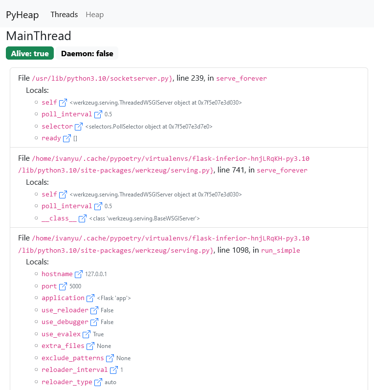
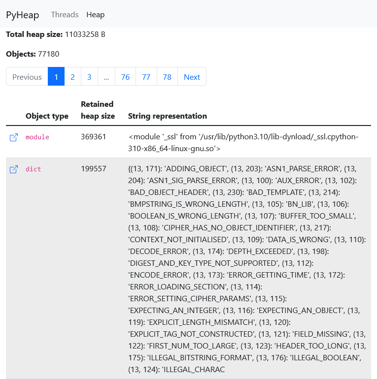
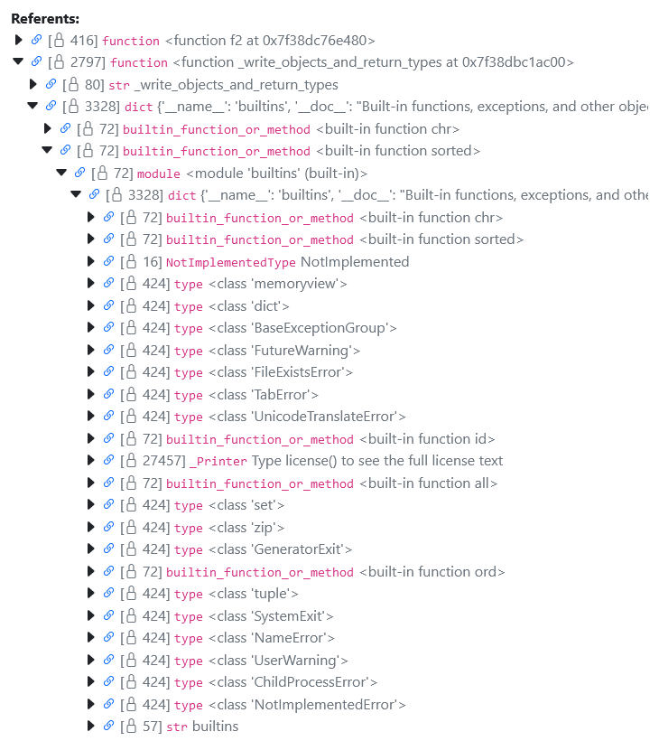

# PyHeap

A heap dumper and analyzer for CPython based on GDB.

The product consists of two parts:
1. The zero-dependency dumper script.
2. The Flask-based UI for heap dump visualization.

## Compatibility

The dumper is compatible with a target process running on:
- CPython 3.8;
- CPython 3.9;
- CPython 3.10;
- CPython 3.11 (3.11.0rc2 at the moment).

Some popular libraries were tested:
- Django;
- FastAPI;
- Flask;
- SQLAlchemy
- Jupyter.

## Usage

### Dumping the heap
Find the PID of a running CPython process you're interested in.

Run:
```bash
$ python3 pyheap/src/pyheap_dumper.py --pid <pid> --file heap.json.gz
```

See 
```bash
$ python3 pyheap/src/pyheap_dumper.py -h
```
for additional options.

### Browser-based UI

You need a Python installation with Flask to run it. There's a Poetry environment for your convenience in [pyheap-ui/](pyheap-ui/).

To view the heap dump with the browser-based UI, go to [pyheap-ui/](pyheap-ui/) and run:
```bash
PYTHONPATH=src poetry run python -m ui --file heap.json.gz
```
and open [http://127.0.0.1:5000](http://127.0.0.1:5000).








### Command-line heap analyzer

Analyze the heap with the `analyzer` module:
```bash
$ python3 -m pyheap.analyzer retained-heap --file heap.json.gz

[2022-09-07 09:40:46,594] INFO Loading file heap.json.gz
[2022-09-07 09:40:46,633] INFO Loading file finished in 0.04 seconds
[2022-09-07 09:40:46,633] INFO Heap dump contains 18269 objects
[2022-09-07 09:40:46,646] INFO 1761 unknown objects filtered
[2022-09-07 09:40:46,681] INFO Indexing inbound references
[2022-09-07 09:40:46,695] INFO Inbound references indexed in 0.01 seconds
[2022-09-07 09:40:46,701] INFO Loaded retained heap cache
  heap.json.gz.ce7ade900911c6edac5fe332a36d43d0a76ac103.retained_heap
Address         | Object type     | Retained heap size | String representation  
--------------------------------------------------------------------------------
140494124474176 | dict            |            1101494 | {'__name__': '__main__'
140494121988112 | str             |            1000049 | xxxxxxxxxxxxxxxxxxxxxxx
140494125217792 | list            |             100113 | ['xxxxxxxxxxxxxxxxxxxxx
94613255597520  | str             |             100049 | xxxxxxxxxxxxxxxxxxxxxxx
140494126265024 | dict            |              89546 | {'/usr/lib/python310.zi
140494124519104 | dict            |              70465 | {'__name__': 'os', '__d
140494123404608 | dict            |              64157 | {'__name__': 'typing', 
140494126265984 | dict            |              35508 | {'__name__': 'builtins'
140494125686720 | dict            |              32920 | {94613227788704: <weakr
94613255487824  | ABCMeta         |              32790 | <class 'collections.Use
140494125072000 | dict            |              31566 | {'__module__': 'collect
140494124621856 | _Printer        |              28111 | Type license() to see t
140494124550272 | dict            |              28063 | {'_Printer__name': 'lic
140494105358656 | list            |              27229 | ['A. HISTORY OF THE SOF
140494125744640 | frozenset       |              25447 | frozenset({'_curses', '
140494124629056 | FileFinder      |              22804 | FileFinder('/usr/lib/py
140494124679104 | dict            |              22756 | {'_loaders': [('.cpytho
...
```
(in the repo root directory).

## How it works

PyHeap uses GDB to attach to a running CPython process (the debug symbols are not required).

After the debugger is attached, a break point is set at the [`_PyEval_EvalFrameDefault`](https://github.com/python/cpython/blob/3594ebca2cacf5d9b5212d2c487fd017cd00e283/Python/ceval.c#L1577) function inside CPython, which indicated the Python stack frame execution. It's a good spot to intervene into the CPython's normal job.

When the break point is hit by one of the threads, the Python script `injector.py` is loaded and executed (as `$dump_python_heap` function) in the context of the GDB's own Python interpreter. The main purpose of this script is to make the target CPython process to load the `dumper.py` module and execute the `dump_heap` function in it.

`dump_heap` uses the Python standard modules `gc` and `sys` to collect some information about heap objects and their sizes. `dump_heap` does some job to avoid irrelevant garbage created by itself to appear in the heap dump, but some traces of it will be there.

### What objects are dumped

Currently, the dumper sees objects traced by the CPython garbage collector and the objects they reference to (more precisely, the ones they return in their [`tp_traverse`](https://docs.python.org/3/c-api/typeobj.html#c.PyTypeObject.tp_traverse)).

The thread stacks and their locals are not analyzed at the moment.

