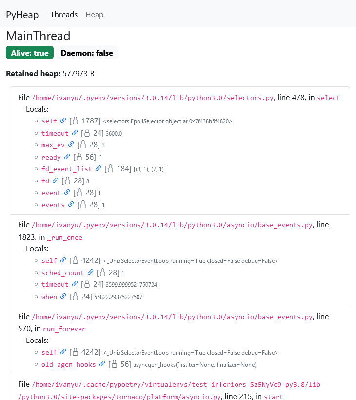
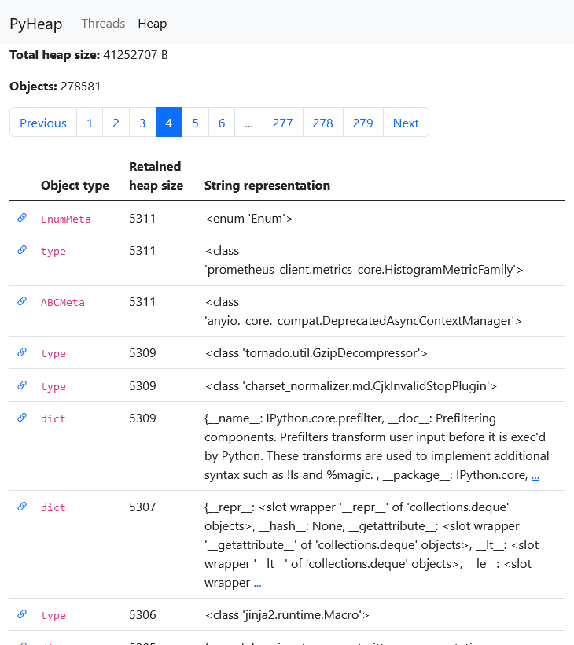
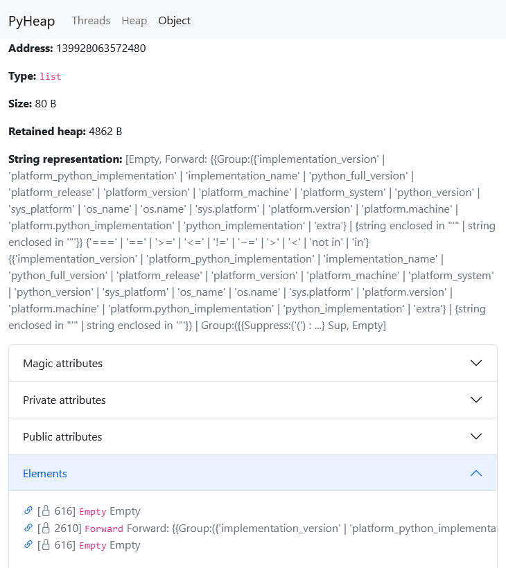
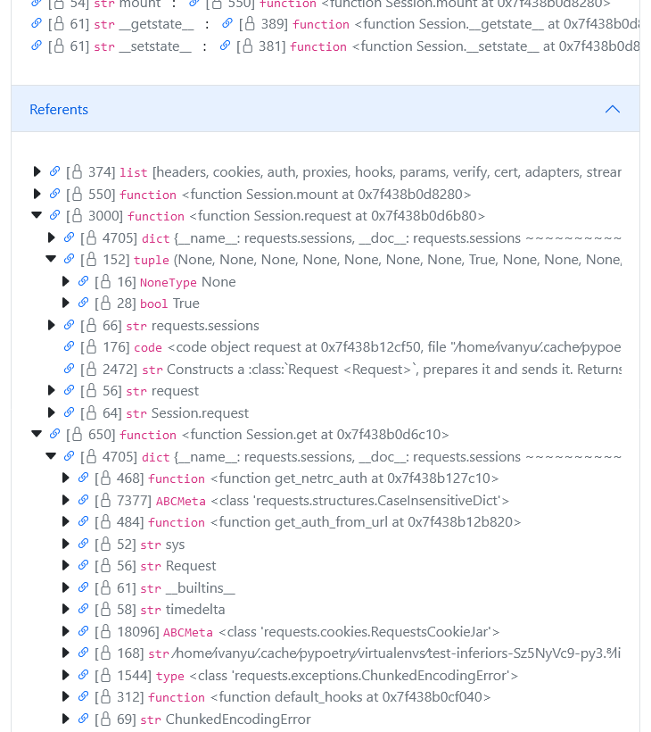

# PyHeap

A heap dumper and analyzer for CPython based on GDB.

The product consists of two parts:
1. The dumper which uses GDB.
2. The Flask-based UI for heap dump visualization.

## Requirements

The dumper needs the following:
1. GDB must be installed where the dumper runs (e.g. on the machine host), but is not needed near a target process (e.g. in a container).
2. CPython 3.8 - 3.11.
3. Docker CLI for working with Docker containers directly (e.g. calling `docker inspect`).

## Compatibility

**Only Linux** is supported at the moment.

The dumper is compatible with a target process running on CPython 3.8 - 3.11.

The target process were tested in the following OSes:
- Alpine Linux;
- Ubuntu;
- Fedora;
- Debian.

Some popular libraries were tested:
- Django;
- FastAPI;
- Flask;
- SQLAlchemy
- Jupyter.

## Usage

### Heap Dumping
Find the PID of a running CPython process you're interested in.

Run:
```bash
$ python3 pyheap_dump --pid <pid> --file heap.pyheap
```

The heap file is written by the target process in its `/tmp`, but is moved subsequently under the specified path.

If the target process belongs to a different user, use `sudo`.

See 
```bash
$ python3 pyheap_dump -h
```
for additional options.

#### Running in a Docker Container

The dumper also can be run in a Docker container.

If the target process is also running in a Docker container, it's possible to attach the dumper container directly to it:

```bash
docker run \
  --rm \
  --pid=container:<container_name_or_id> \
  --cap-add=SYS_PTRACE \
  --volume $(pwd):/heap-dumps \
  ivanyu/pyheap-dumper:latest \
  --pid 1 \
  --file /heap-dumps/heap.pyheap
```

You can replace `latest` with a release version.

If you need to run it against a process on the host, use `--pid=host` instead.

### Containers and Namespaces

PyHeap can attach to targets that are running in Linux namespaces. Docker containers is the most common example of this situation.

**Note:** Some Docker setups doesn't have real processes running on the same (virtual) machine where `docker ...` control commands are executed. One example is WSL 2 + Docker Desktop on Windows. PyHeap doesn't work in such environments.

If you want to use PyHeap on the root process in a Docker container, use `--docker-container` instead of `--pid/-p` and specify the name or ID:

```bash
$ sudo python3 pyheap_dump --docker-container <container_name> --file heap.pyheap
```

If it's not the root process in the container, or you work with another container system (e.g. systemd-nspawn) or just generic Linux namespaces, you need to find the target PID. Please mind that this must be the PID from the dumper point of view: processes in namespaces can have their own PID numbers. For example, if you're about to run the dumper on a Linux host and the target process is running in a container, check the process list with `ps` or `top` on the host. Use `--pid/-p` for the dumper.

If the target process is running under a different user (normal for Docker), you need to use `sudo` with `python3 pyheap_dump ...`.

PyHeap dumper will automatically transfer the heap file from the target namespace to the specified location.

### Browser-Based UI

The browser-based PyHeap UI is a convenient way to explore heap dumps. It can show threads, objects with the most retained heap. It allows exploring individual objects as well.



<details>
  <summary>More screenshots</summary>







</details>

#### Running with Docker

Running the PyHeap UI with Docker is simple:

```bash
docker run -it --rm \
  --userns=host --user=$(id -u):$(id -g) \
  -v ${PWD}:/pyheap-workdir \
  --name pyheap-ui -p 5000:5000 \
  ivanyu/pyheap-ui:latest \
  heap.pyheap
```
and open [http://127.0.0.1:5000](http://127.0.0.1:5000).

You can replace `latest` with a release version.

The images are published on [Docker Hub](https://hub.docker.com/repository/docker/ivanyu/pyheap-ui).

#### Running as a Python Program

You need a Python installation with Flask to run it. There's a Poetry environment for your convenience in [pyheap-ui/](pyheap-ui/).

To view the heap dump with the browser-based UI, go to [pyheap-ui/](pyheap-ui/) and run:
```bash
PYTHONPATH=src poetry run python -m ui --file heap.pyheap
```
and open [http://127.0.0.1:5000](http://127.0.0.1:5000).

### Command-Line Heap Analyzer

<details>
  <summary>In case you cannot use the browser-based UI</summary>

Analyze the heap with the `analyzer` module:
```bash
$ PYTHONPATH=src poetry run python -m analyzer retained-heap --file heap.pyheap

[2022-09-07 09:40:46,594] INFO Loading file heap.json.gz
[2022-09-07 09:40:46,633] INFO Loading file finished in 0.04 seconds
[2022-09-07 09:40:46,633] INFO Heap dump contains 18269 objects
[2022-09-07 09:40:46,646] INFO 1761 unknown objects filtered
[2022-09-07 09:40:46,681] INFO Indexing inbound references
[2022-09-07 09:40:46,695] INFO Inbound references indexed in 0.01 seconds
[2022-09-07 09:40:46,701] INFO Loaded retained heap cache
  heap.json.gz.ce7ade900911c6edac5fe332a36d43d0a76ac103.retained_heap
Address         | Object type     | Retained heap size | String representation  
--------------------------------------------------------------------------------
140494124474176 | dict            |            1101494 | {'__name__': '__main__'
140494121988112 | str             |            1000049 | xxxxxxxxxxxxxxxxxxxxxxx
140494125217792 | list            |             100113 | ['xxxxxxxxxxxxxxxxxxxxx
94613255597520  | str             |             100049 | xxxxxxxxxxxxxxxxxxxxxxx
140494126265024 | dict            |              89546 | {'/usr/lib/python310.zi
140494124519104 | dict            |              70465 | {'__name__': 'os', '__d
140494123404608 | dict            |              64157 | {'__name__': 'typing', 
140494126265984 | dict            |              35508 | {'__name__': 'builtins'
140494125686720 | dict            |              32920 | {94613227788704: <weakr
94613255487824  | ABCMeta         |              32790 | <class 'collections.Use
140494125072000 | dict            |              31566 | {'__module__': 'collect
140494124621856 | _Printer        |              28111 | Type license() to see t
140494124550272 | dict            |              28063 | {'_Printer__name': 'lic
140494105358656 | list            |              27229 | ['A. HISTORY OF THE SOF
140494125744640 | frozenset       |              25447 | frozenset({'_curses', '
140494124629056 | FileFinder      |              22804 | FileFinder('/usr/lib/py
140494124679104 | dict            |              22756 | {'_loaders': [('.cpytho
...
```
(in the repo root directory).
</details>

## How It Works

PyHeap uses GDB to attach to a running CPython process.

After the debugger is attached, a break point is set at the [`_PyEval_EvalFrameDefault`](https://github.com/python/cpython/blob/3594ebca2cacf5d9b5212d2c487fd017cd00e283/Python/ceval.c#L1577) function inside CPython, which indicated the Python stack frame execution. It's a good spot to intervene into the CPython's normal job.

When the break point is hit by one of the threads, the Python script `injector.py` is loaded and executed (as `$dump_python_heap` function) in the context of the GDB's own Python interpreter. The main purpose of this script is to make the target CPython process to load the `dumper_inferior.py` script and execute it in the context of the target process.

The dumper script uses the Python standard modules `gc` and `sys` to collect some information about heap objects and their sizes. It does some job to avoid irrelevant garbage created by itself to appear in the heap dump, but some traces of it will be there.

A dump is not a fair snapshot in time as some threads and the garbage collector continue working while it's being done.

### What Objects Are Dumped

Currently, the dumper sees objects traced by the CPython garbage collector and the objects they reference to (more precisely, the ones they return in their [`tp_traverse`](https://docs.python.org/3/c-api/typeobj.html#c.PyTypeObject.tp_traverse)).

## Development

### Integration Tests

Integration tests run on CI. However, end-to-end tests that use the real GDB cannot be run in GitHub Actions. You can run them locally using
```bash
make clean integration-tests
```

You need [pyenv](https://github.com/pyenv/pyenv) with Python 3.8, 3.9, 3.10, and 3.11 installed and [Poetry](https://python-poetry.org/).

## License

[Apache License, Version 2.0](LICENSE).
